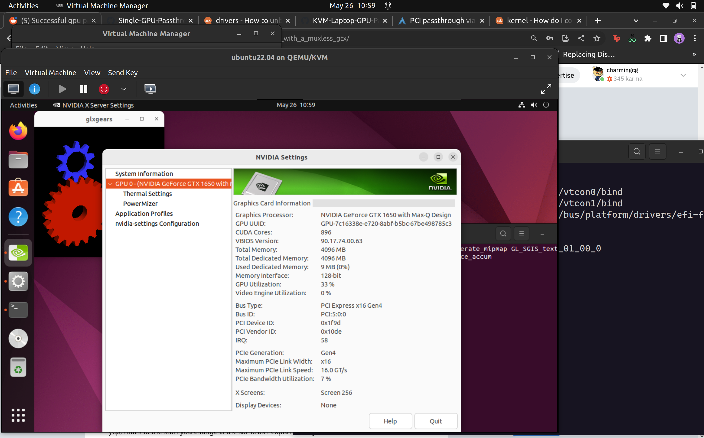

# VFIO passthrough on muxless NVIDIA GPU

## Neofech Output
```bash
OS: Ubuntu 22.04.2 LTS x86_64 
Host: Vivobook_ASUSLaptop X3400PH_K3400PH 1.0 
Kernel: 5.19.0-42-generic 
Uptime: 1 hour, 40 mins 
Packages: 1788 (dpkg), 35 (flatpak), 11 (snap) 
Shell: bash 5.1.16 
Resolution: 2880x1800 
DE: Unity 
WM: Mutter 
WM Theme: Adwaita 
Theme: Yaru-magenta-dark [GTK2/3] 
Icons: Yaru-magenta [GTK2/3] 
Terminal: vscode 
CPU: 11th Gen Intel i5-11300H (8) @ 4.400GHz 
GPU: Intel TigerLake-LP GT2 [Iris Xe Graphics] 
GPU: NVIDIA GeForce GTX 1650 Mobile / Max-Q 
Memory: 3135MiB / 15693MiB 
```
## Requirements
```bash
# install required software
sudo apt install libvirt-client libvirt-daemon virt-manager
```
## Setup
Add user to requried groups.
```bash
sudo usermod -a $USER -G libvirt
sudo usermod -a $USER -G kvm
```
Add the following kernel parameters in `/etc/default/grub`.
```bash
intel_iommu=on iommu=pt
```
Add vfio modules to initramfs image (`/etc/initramfs-tools/modules`).
```bash
vfio
vfio_iommu_type1
vfio_pci
vfio_virqfd
vhost-net
```
Re-build Initramfs image.
```bash
sudo update-initramfs -u -k all
```

Switch to integrated graphics to prevent nvidia module from loading.
```bash
sudo prime-select intel
```
Reboot to apply changes.
```bash
sudo reboot now
```
Now we can succesfully bind NVIDIA graphics card to the vfio driver after the reboot. This is done by:
```bash
set -x

# unbind the vtconsoles (you might have more vtconsoles than me, you can check by running: dir /sys/class/vtconsole
echo 0 > /sys/class/vtconsole/vtcon0/bind
echo 0 > /sys/class/vtconsole/vtcon1/bind

# unbind the efi framebruffer
echo efi-framebuffer.0 > /sys/bus/platform/drivers/efi-framebuffer/unbind

# avoid race condition (I'd start with 5, and if the gpu passes inconsistently, change this value to be higher)
sleep 4

# detach the gpu
virsh nodedev-detach pci_0000_01_00_0

# load vfio
modprobe vfio-pci
```

Finally Create a VM in virt-manager and pass the GPU from the GUI.